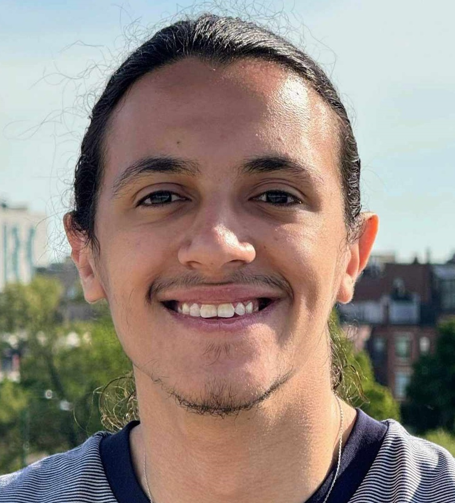

## About Me

Hi! I'm a master's student studying Electrical Engineering & Computer Science @ MIT. I'm currently focusing my studies on RL fine-tuning of foundational models. Outside of school, I like piano, bachata, and singing in choir.

## Research Interests

I'm interested in generative AI and RL, with applications to protein design and robotics.
