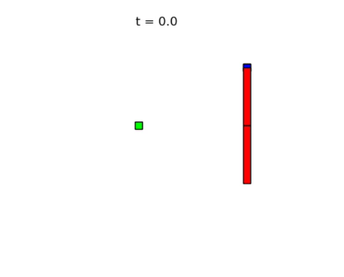
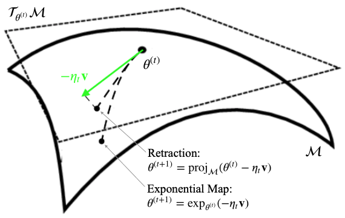
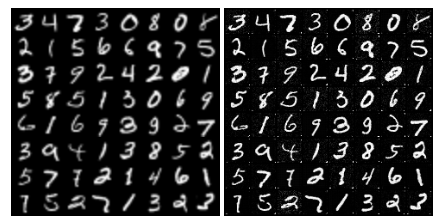

# Robotics

## Uneven Bars Robot (Final project for Underactuated Robotics)

The goal was to synthesize a controller for a robot to perform in the uneven bars gymnastics event. Specifically, to swing from a still position and jump from the high to the low bar.

The controller was designed to minimize the total energy spent and synthesized via non-linear optimization. The hardest part to figure out was how to model what happens when the robot loses contact with the bar, since the dynamics change. The solution was to treat the point of contact with the bar as a free-moving joint that is locked in place until release. Feel free to read the detailed report [here](6.8210 final report.pdf).

---

# Deep Learning

## Towards Theoretically-Grounded GAN Training (Final project for Topics in Multi-Agent Learning)

GANs are astonishing generative models that remained the best models we have for years, but they're notoriously difficult and unstable to train. One reason is that unlike gradient descent that has theoretical convergence guarantees, the training dynamics for GANs are more heuristic and don't actually solve the general problem of finding a Nash equilibrium that training GANs is a special case of.

The goal of the project was to find practically-implementable dynamics that actually converge. One reason I believe diffusion models overtook GANs is that their optimization problem is much easier to solve, a standard minimization problem instead of a min-max problem. The project turns the GAN optimization problem into a minimization problem as well, except on a manifold. The idea is to optimize the generator and discriminator parameters simultaneously while staying on the manifold where the discriminator gives a best response to the generator. For the technical details, please read the [project report](6_S890_project.pdf).

## Diffusion Model Theory and Adaptation to MRFs (Final Project for Algorithmic Statistics)

Diffusion models are the current best method for learning how to sample from general distributions given some samples. But what if the distributions have some structure to them?

This project aimed at adapting diffusion models to distributions that could be modelled as Markov Random Fields (MRFs). MRFs model high-dimensional distributions where each variable depends on a few other variables. A very practical use of that is image super-resolution tasks, where each new pixel in the upsampled images only really depends on its local neighborhood in the low-quality image. I showed that if we leverage the structure of MRFs, in theory, we need much smaller neural networks inside our diffusion models, which could make models for tasks like image super-resolution much faster to train.

I also studied optimizing the noise schedule for diffusion models so they converge faster to these structured distributions. The details can be found [here](6_S896_project.pdf).

